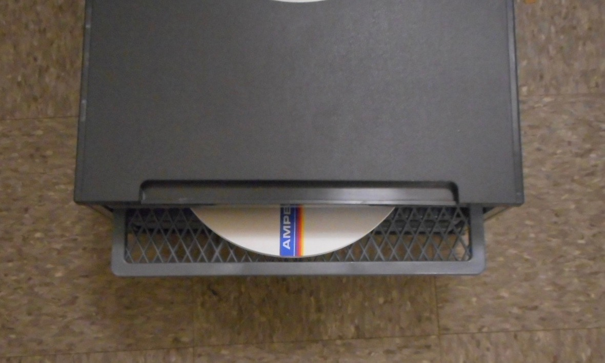
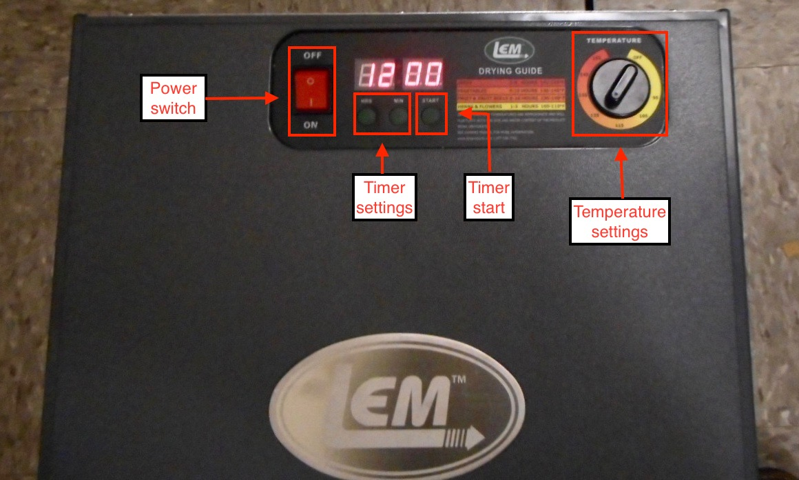

# Treatment for 1/4-inch audio tape with "sticky-shed" syndrome. 

## Overview. 

The following workflow is a treatment to stabilize 1/4-inch audio tape with "stick-shed" syndrome.  It follows the procedure described in the Ampex patent (US 6797072 B1),
*Process for restoring magnetic recording tape damaged by “sticky shed” syndrome*.  

The stabilization is temporary, and so tapes should be reformatted soon after the treatment is performed.

### Supplies. 

LEM 1152 5-tray food dehydrator, or comparable convection oven 

## Workflow. 

1)  Load the tapes into a room-temperature oven.

*Example, Tape on a tray of the LEM dehydrator*  

2) Set the timer for 12 hours

3) Set the temperature to 122 degrees (F).

4) Start the timer. 
  
*Example, LEM dehydrator settings*  

5) At the end of the 12-hour cycle, do not remove the tapes, but allow them to cool and to re-acclimate in the oven for another 12 hours.

6) Remove the tapes from the oven, and clean them using the procedure described in, *Workflow for the surface cleaning of the emulsion layer of open-reel audio tape*.  LINK HERE?

